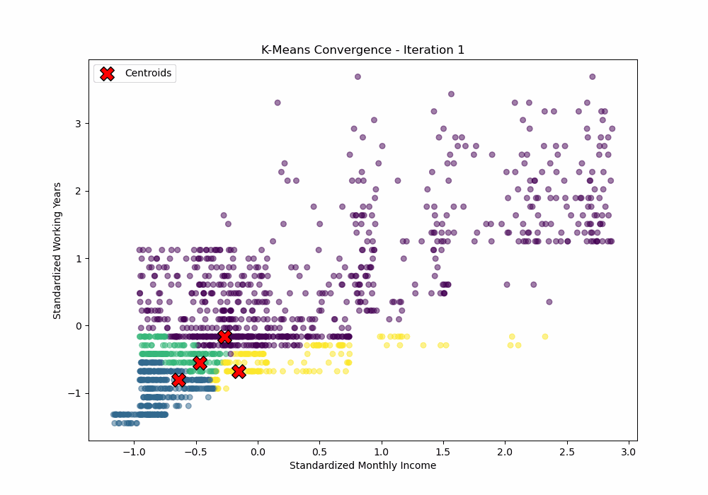
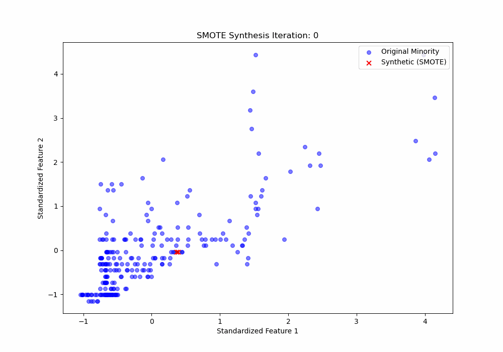
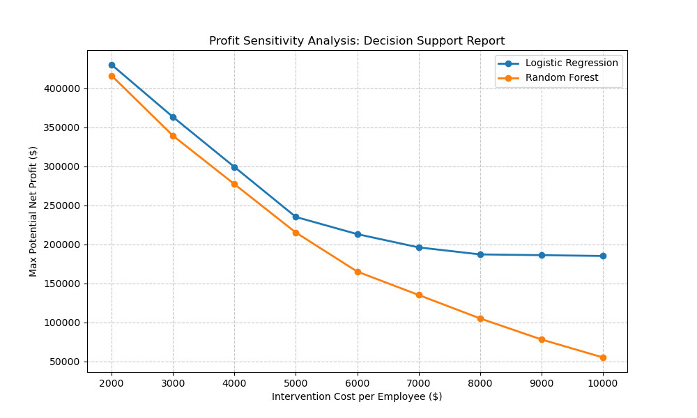
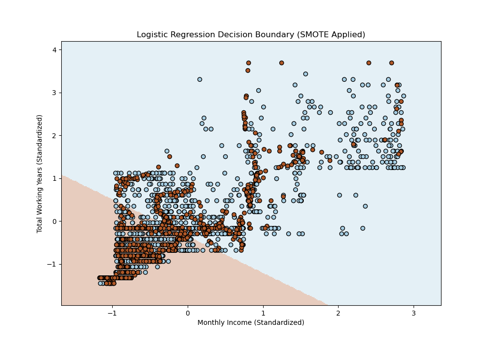

# 📊 Employee Attrition ROI Optimizer

### **Course:** Computer Applications in Business Systems (کاربرد کامپیوتر در سیستم‌های تجاری)

**Professor:** [Dr. Fatemeh Elahi]

**Developed by:** [Hossein Abedzadeh] | [Meysam Najafifard] | [Saman Ghorayshi]

---

## 📝 Project Executive Summary

This project implements a **Decision Support System (DSS)** designed to predict employee attrition and optimize the financial return on retention strategies. By integrating machine learning with financial logic, the system identifies high-risk employee "personas" and determines the optimal probability threshold to maximize **Net Profit**.

Based on our final audit, the system identified a strategy that yields a net profit of **$62,000** on the test dataset by targeting only high-certainty leavers (Optimal Threshold: 0.73).

---

## 🖼️ Visual Intelligence Gallery

*Our system generates dynamic visualizations to explain complex AI transitions to stakeholders.*

### 1. High-Dimensional Cluster Formation

This animation demonstrates the **K-Means** algorithm identifying 4 distinct employee personas by analyzing 35 behavioral and financial variables simultaneously.


### 2. SMOTE Synthetic Balancing

To solve the "Imbalanced Data" problem (where only 16% of employees leave), our AI generates synthetic "leavers" to help the model learn resignation patterns more effectively.


### 3. Profit Sensitivity Analysis

This plot proves that **Logistic Regression** is more financially robust than Random Forest. As the cost of intervention increases, our chosen model maintains a higher profit margin.


### 4. Mathematical Decision Boundaries

A visual representation of how the model separates "leavers" from "stayers" based on the optimized threshold.

---

## 📂 Project Architecture

The repository follows a professional R&D-to-Production hierarchy, ensuring clean separation of concerns.

```text
.
├── core_system/           # Operational Engine
│   └── production_engine.py
├── data/                  # Source Dataset
│   └── Attrition.csv
├── docs/                  # Technical audit & verification
│   └── model_verification_audit.py
├── experiments/           # R&D Sandbox
│   ├── benchmarking/      # Model competition & Sensitivity Analysis
│   │   ├── model_benchmark.py
│   │   ├── run_full_analysis.py
│   │   ├── sampling_strategy_assessment.py
│   │   └── sensitivity_analysis_audit.py
│   ├── prototypes/        # Persona discovery & business logic
│   │   ├── 3_discovery_persona_analysis.py
│   │   ├── business_impact_optimizer.py
│   │   └── ensemble_risk_validator.py
│   └── visualizations/    # Process animations & Decision boundaries
│       ├── cluster_formation_viz.py
│       ├── cluster_optimization_audit.py
│       ├── logistic_boundary_viz.py
│       └── smote_balancing_viz.py
├── outputs/               # Generated Visual Assets & CSV Reports
├── requirements.txt       # Project Dependencies
└── run_all.py             # Full pipeline automation script

```

---

## 🔬 Technical Methodology

### 1. Persona Extraction (Unsupervised)

Using **K-Means Clustering**, we segmented the workforce into 4 groups. **Cluster 0** was identified as the "High-Risk Persona," containing 720 employees with a significantly higher attrition rate of **20.8%**. We used the Elbow Method to confirm  as the optimal number of clusters.

### 2. Model Competition: Why Logistic Regression (LR)?

Through **Sensitivity Analysis**, we compared Logistic Regression against Random Forest (RF). LR was chosen for its **Financial Robustness** and superior performance as costs increased:

| Intervention Cost | LR Net Profit | RF Net Profit | Winner |
| --- | --- | --- | --- |
| **$2,000 (Low)** | **$430,000** | $416,000 | **LR** |
| **$6,000 (Med)** | **$213,000** | $165,000 | **LR** |
| **$10,000 (High)** | **$185,000** | $55,000 | **LR** |

### 3. Mathematical Integrity & Audit

The model's logic was verified via manual **Sigmoid Function** calculations in `docs/model_verification_audit.py` to ensure software outputs align with statistical theory:


---

## 💰 Business Impact & ROI

The system optimizes the decision threshold (set at **0.73**) to maximize the following ROI formula:


* **Replacement Savings:** **$15,000** (Cost to hire/train a replacement).
* **Intervention Cost:** Tested from **$2,000** up to **$10,000**.
* **Performance:** Our Ensemble Validation shows the capability to reach a **100% Recall** (identifying every leaver) if the business accepts a lower threshold for widespread intervention.

---

## 🤖 AI Usage & Disclosure

In alignment with modern industry standards, Large Language Models (LLMs) were utilized as **Strategic R&D Assistants** in this project:

* **Code Refactoring:** Ensuring the modular architecture and relative pathing follow clean-code principles.
* **Audit Support:** Cross-checking manual Sigmoid calculations against Scikit-Learn outputs.
* **Documentation:** Formatting technical analysis into professional-grade business reports and README structures.
*The core business strategy, ROI modeling, and strategic model selection were led by the project team.*

---

## 🚀 How to Run

1. **Setup:** Ensure `Attrition.csv` is in the `/data` folder.
2. **Install Dependencies:** `pip install -r requirements.txt`
3. **Execute All:** Run `python run_all.py` to regenerate all reports and animations.

---

*This system demonstrates the application of predictive analytics in modern Business Information Systems to convert raw HR data into measurable financial savings.*