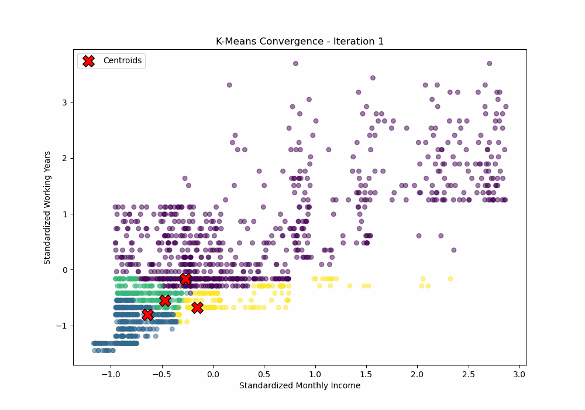
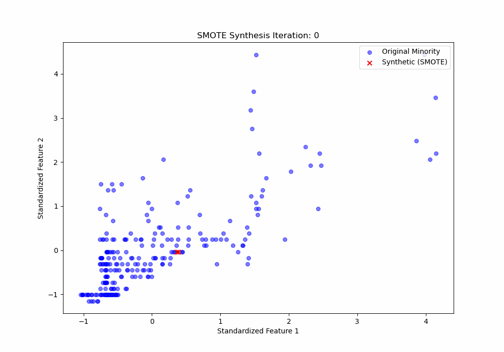
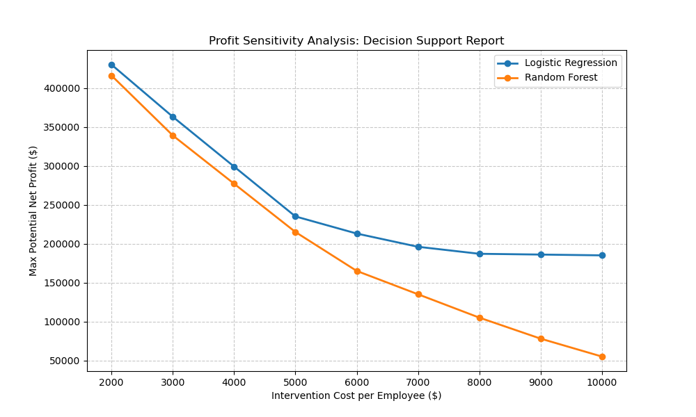
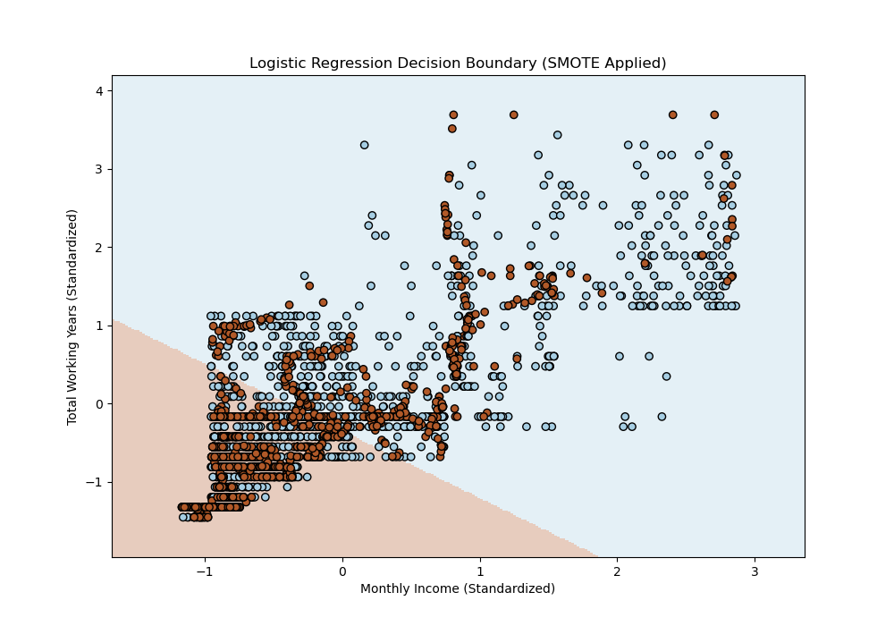
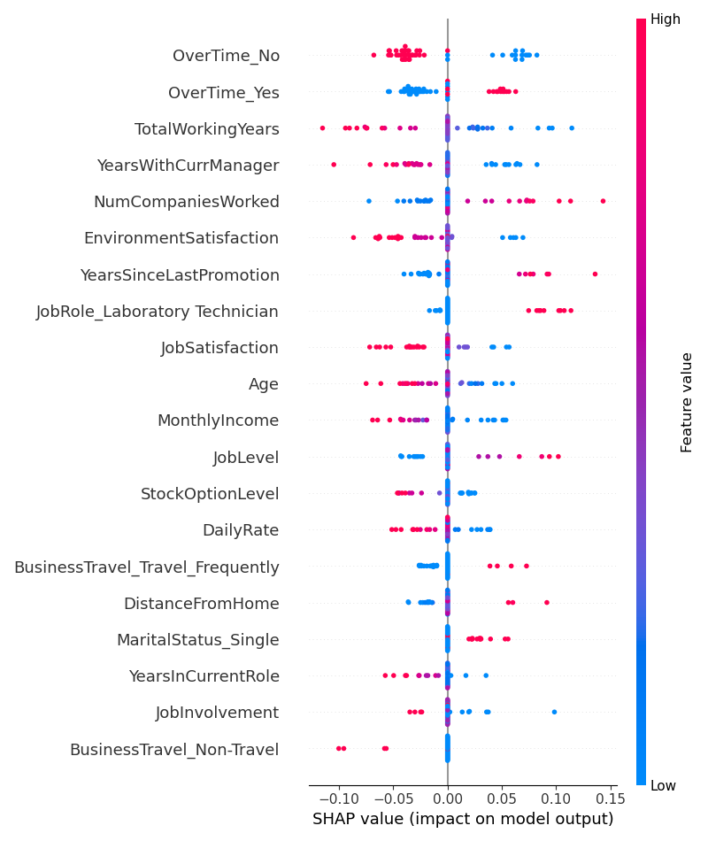
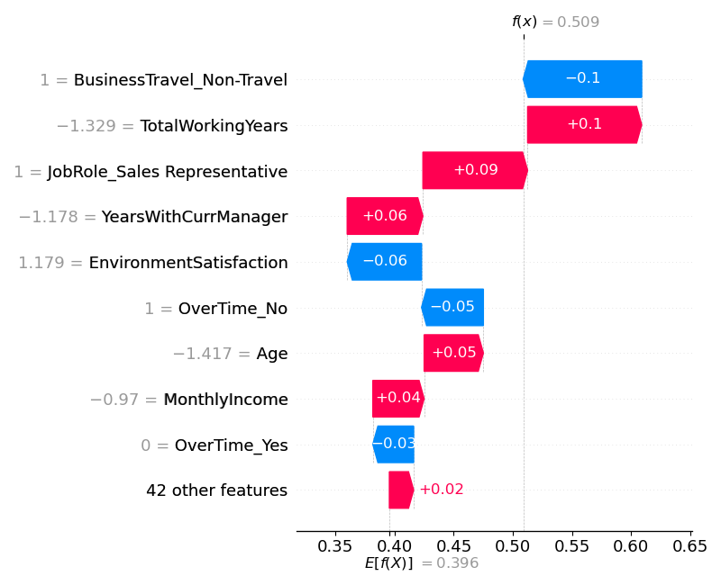

# Employee Attrition ROI Optimizer

Predicts which employees are likely to leave, then finds the optimal
intervention threshold to maximize net profit. Logistic regression + SMOTE,
K-Means clustering, SHAP explainability.

On the test dataset, the optimal threshold (0.73) gives ~$62k net profit by
targeting only high-certainty leavers.

---

## Results

| Intervention Cost | LR Net Profit | RF Net Profit |
|-------------------|-------------|---------------|
| $2,000 (low)      | $430,000    | $416,000      |
| $6,000 (med)      | $213,000    | $165,000      |
| $10,000 (high)    | $185,000    | $55,000       |

Logistic Regression wins because it's more robust to rising intervention
costs. Random Forest collapses at $10k while LR stays profitable.

---

## Visualizations








---

## Structure

```
core_system/          production engine
data/                 Attrition.csv dataset
docs/                 verification audit
experiments/
  benchmarking/       model comparison + sensitivity
  prototypes/         persona discovery, XAI, ensemble
  visualizations/     cluster + SMOTE + boundary plots
outputs/              generated charts + CSV reports
run_all.py            runs the full pipeline
```

---

## How to run

```bash
git clone https://github.com/Saman-ghorayshi/Employee_Attrition_ROI_Optimizer.git
cd Employee_Attrition_ROI_Optimizer
conda env create -f environment.yml
conda activate dss_env
python run_all.py
```

Make sure `Attrition.csv` is in the `data/` folder.
